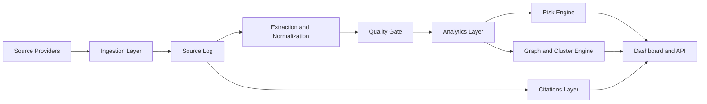

# Architecture Blueprint

## System objective

The platform operates as a hybrid legal-intelligence product that collects source-linked fraud signals, converts them into structured legal records, ranks recurring entities, and presents explainable outputs through an analyst dashboard.

## Target architecture

## Core components

### 1. Source providers

The MVP exposes provider interfaces rather than baking every website into one script. This is more scalable because teams can add:

- official portals
- RSS feeds
- known HTML pages
- search or monitoring APIs
- premium data connectors in later versions

### 2. Source log

Every fetched item is preserved with:

- title
- URL
- source name
- reliability label
- query text
- publication date
- fetch timestamp

This makes the product audit-friendly and improves analyst trust.

### 3. Extraction and normalization

The extraction layer turns raw source text into structured records. The MVP uses heuristics and mappings; a production version can swap in a retrieval or LLM-assisted extractor behind the same interface.

### 4. Quality gate

The pipeline separates:

- source coverage
- analytics readiness

This is one of the most important architectural choices because it prevents noisy web rows from polluting risk outputs.

### 5. Analytics layer

The analytics stage groups repeated entities, counts source diversity, collects district spread, and measures legal-section diversity.

### 6. Risk engine

Risk scores are transparent and tunable. In a commercial product, this is a strong feature because enterprise buyers want explainability more than black-box scoring.

### 7. Dashboard and API surface

The Gradio app is the MVP interface. The long-term product path should expose the same processed outputs through:

- a web app for analysts
- scheduled alerts
- export endpoints
- a secure API for enterprise integration

## Scale path

### Phase 1

- local or Colab execution
- CSV snapshots
- Gradio front end

### Phase 2

- DuckDB for local analytical speed
- background jobs for scheduled refresh
- FastAPI service layer
- Redis caching for expensive aggregations

### Phase 3

- Postgres for operational data
- object storage for raw source archives
- queue-based ingestion workers
- tenant-aware access controls
- audit logs and review workflows

## Recommended production upgrades

- Replace ad hoc scraping with governed connectors and API-first providers.
- Add entity review queues so analysts can confirm or reject extracted fields.
- Store record provenance at every transformation step.
- Separate ingestion, scoring, and presentation into deployable services.
- Introduce observability: job logs, freshness metrics, extraction confidence, and source failures.

